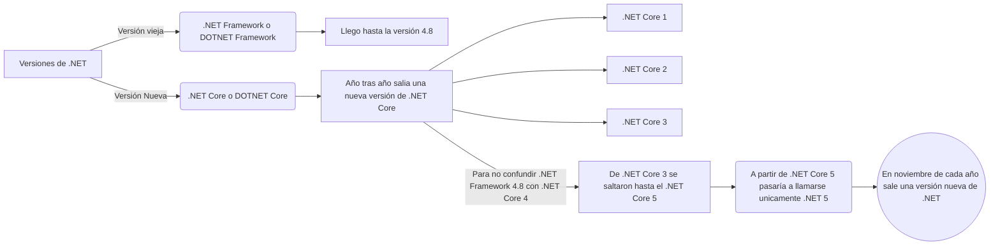

# Sección 1: Introducción
## Qué es .NET?

 1. NET o DOTNET es una **plataforma de desarrollo** que sirve para
    desarrollar distintos tipos de aplicaciones.
 2. .NET no es un lenguaje de programación, es un ambiente en el que
    podemos ejecutar distintos tipos de aplicaciones.
 3. En .NET podemos utilizar distintos lenguajes de programación para el
    desarrollo de aplicaciones, como ser:
	    * C# (Es el más popular)
	    * F#
	    * Visual Basic
## Historia de .NET
- Fue creado por Microsoft en 2002 para correr en Windows.
- .NET llego hasta la versión 4.8
- Un cambio de visión en Microsoft llego a la conclusión de que .NET debía abrirse, no debía ser un framework exclusivo de Windows, sino que debía ser multiplataforma, ademas, debía ser más rápido y ligero.
- En 2014 fue anunciado **DOTNET Core** o **.NET Core**

 - .NET Framework o DOTNET Framework es la versión vieja, llego hasta la versión 4.8.
 - .NET Core o DOTNET Core es la versión Nueva, salio en 2016 en su versión 1.
## ¿Qué es C#?
- Es un lenguaje de programación multiparadigma.
- Fue creado en el año 2000 por Microsoft.
- Se puede desarrollar diferentes tipos de aplicaciones.
- Es un lenguaje fuertemente tipado. 
- En cuanto a POO, C# es un lenguaje basado en clases.
- En cuanto a Programación Funcional, C# Nos permite trabajar con funciones de primera clase.
## ¿Qué es ASP.NET Core?
- Es un framework para desarrollar aplicaciones web.
- Es multiplataforma.
- ASP: Active Server Pages (Sitios dinámicos)

### Tipos de aplicaciones en ASP.NET
- Aplicaciones MVC:  Patrón Modelo-Vista-Controlador.
- Razor Pages: Todo lo que se puede hacer con MVC se puede hacer en Razor Pages.
- WEB Api's: Se usa cuando no queremos generar interfaces de usuarios.
- Blazor: Enviar el código de C# al navegador del usuario. Blazor es una tecnología de ASP.NET que nos permite crear aplicaciones web interactivas.
- gRPC: Framework que permite hacer llamadas de procedimientos remoto. Nos permite comunicarnos de manera muy rápida entre diferentes aplicaciones.